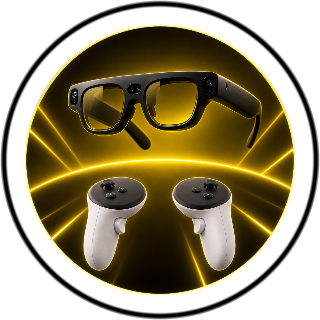
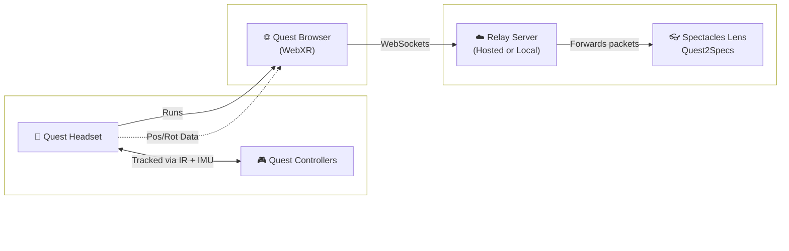

<h1 align="center">🥽 Quest2Specs</h1>

<p align="center">
  Use your <b>Meta Quest controllers</b> as controller hand inputs for <b>Snap Spectacles!</b><br>
  Quest2Specs reads your Quest controller's position, rotation, and button presses, and streams that data to a virtual hand in your Spectacles Lens - so you get full hand tracking, pinch, and grab, regardless of lighting conditions.
</p>

<p align="center">
  <a href="#features">✨ Features</a> •
  <a href="#supported-devices">🥽 Devices</a> •
  <a href="#setup">🚀 Setup & Guide</a> •
  <a href="#how-it-works">⚙️ How it works</a> •
  <a href="#troubleshooting">🛠️ Troubleshoot</a> •
  <a href="#structure">📁 Project Structure</a>
</p>

<p align="center">
  
</p>

<video src="https://github.com/user-attachments/assets/7889fa2a-ebb4-415a-b6b0-78cb3ef59662" width="300" controls></video>

---

<a id="features"></a>
## ✨ Features

| Feature | Description |
| :--- | :--- |
| 👐 **6DoF controller hand tracking** | The virtual hand follows your real controller's position, rotation and button input actions 1:1. |
| 🌒 **Works in the dark** | The Quest tracks its controllers with infrared even in the dark, giving you reliable hand input in low light where camera-based hand tracking is at its most challenging. |
| 🤏 **Pinch, grab & poke** | Trigger pinches (index + thumb), grip closes a full fist, and you can poke UI directly. |
| 🎯 **Point-and-select UI** | A ray + cursor lets you select SIK/UIKit interactables at a distance. |
| 🎨 **3D drawing** | Draw in-air, world-locked strokes with the trigger (adjustable thickness/color/auto-delete). |
| 🤲 **Independent hands** | Two hand models, independently calibrated and adjustable with controllers. |

---

<a id="supported-devices"></a>
## 🥽 Supported Devices

| Device | Type | Status | Lighting Environment |
| :--- | :--- | :--- | :--- |
| **Quest 3** | Headset | ✅ Supported (tested on Horizon v2.5 released on June 22, 2026) | ☀️🌙 Bright & Dark |
| **Quest 3S** | Headset | ✅ Supported (tested on v2.5) | ☀️🌙 Bright & Dark |
| **Quest 2** | Headset | ✅ Supported (tested on v2.5) | ☀️ Bright only (Despite controllers having lit IR rings, Quest 2 has no IR illuminator so in the dark, headset loses positional self-tracking) |
| **Spectacles (2024)** | Glasses | ✅ Supported | — |
| **Specs (2026)** | Glasses | ⚠️ Need to test | — |
| **Quest Pro** | Headset | ⚠️ Need to test | — |

---

<a id="setup"></a>
## 🚀 Setup & Guide

There are two ways to run the bridge server that relays data between your Quest and your Spectacles. 

<details open>
<summary><b>🌐 Method 1: Render-Hosted (Easiest)</b></summary>
<br>

<video src="https://github.com/user-attachments/assets/58d55fc0-2d14-4934-97b8-1ab5d2cd0868" width="300" controls></video>

1. **Quest Settings:**
   - **For Quest 3S:** Go to **Settings -> General -> Power -> Display Off** -> Set it to 4 hours or a longer option so that the Quest doesn't power off during the session.
   - **For Quest 3:** In addition to the display setting change, cover the proximity sensor with a small sticky note so the Quest stays on once it's off your head. (Both headsets have this sensor, but in testing the 3S stayed awake with just the display setting.)

2. **Start relay server:**
   - **2.1** On the Quest, open the Quest Browser and go to https://quest2specs.onrender.com.
   - **2.2** Tap **"Enter VR & stream both controllers."**
   - **2.3** Take the headset off and place it **in front of you, facing you**, so its cameras can see your controllers (about a meter away, tilted slightly down toward your hands).

3. **Spectacles:**
   - **3.1** Put on your Spectacles and launch this Quest2Specs project Lens in the draft section that you pushed from your computer to your Specs, or [launch the Lens from this link](https://www.spectacles.com/lens/3e934befff444f5dad0ff119e31f27bc).
   - **3.2** Pick up your Quest controllers. Here are the basic controls:

     | Controller | Hand Action |
     | :--- | :--- |
     | **Trigger** | Pinches (used to select UI and to draw) |
     | **Grip** (side squeeze button) | Makes a full fist |

   - **3.3** If necessary, here is how you recalibrate your controller hand models: <br>
     - Grab your controllers and rest them on your thighs, pointing forward. 
     - Look at your controllers, then click the joystick (press down on the thumbstick) to reset that hand (Do this for both hands).

   - **3.4** If needed, fine-tune:

     | Controller | Hand Action |
     | :--- | :--- |
     | **Move Joystick** | Slide the hand forward/back and left/right |
     | **Primary button (A / X)** | Lower hand |
     | **Secondary button (B / Y)** | Raise hand |

4. **Quest2Specs Lens:**


This is the Settings panel found inside the Quest2Specs lens.

- **Controller Hands 🙌**: Toggles the visibility of the virtual hands driven by your Quest controllers.
- **Debug Panel 🤖**: Shows or hides the developer debug screen (useful for checking connection status).
- **Specs Hands 👓**: Toggles the visibility of the native Spectacles hand tracking models.
- **Draw ✍️**: Enables or disables the 3D drawing mode. When enabled, pull the trigger to draw in the air.
- **Clear Drawing**: Deletes all current 3D drawings from the scene.
- **Instructions 🤝**: Opens or closes the built-in instructions/help panel.

</details>

##

<details close>
<summary><b>💻 Method 2: Self-hosted (For Developers)</b></summary>
<br>
Useful for development or if you'd rather not depend on a hosted server. The free cloudflare tunnel URL changes every time you start it.

1. **On your Mac**, open a terminal window and start the relay:
   ```bash
   cd /[path to the repo]/Quest2Specs/QuestBridge/relay
   npm start
   ```
2. In a **second terminal window**, open a tunnel to it:
   ```bash
   cloudflared tunnel --url http://localhost:8080
   ```
3. Search for the `https://xxxx.trycloudflare.com` URL it prints and copy it. Save it somewhere (like a Google Keep notes) so you can open on the Quest later.
4. **In Lens Studio**, paste that same URL into **both** `ControllerHandDriver` components' `url` field - but swap `https://` for `wss://` at the start (the Lens needs the WebSocket address). So in the url field it will look like 'wss://xxxx.trycloudflare.com'. Save and push the project to your Spectacles.
5. **On the Quest**, open the **original `https://xxxx.trycloudflare.com`** URL and tap **"Enter VR & stream both controllers."**


6. Take the headset off, put on your Spectacles, launch the Lens, and calibrate your controllers exactly as in Method 1.
</details>

---

<a id="how-it-works"></a>
## ⚙️ How it works

<video src="https://github.com/user-attachments/assets/1af46e25-a788-45d8-8057-8567ef959fab" width="300" controls></video>

##
<details open>
<summary><b>📐 System Architecture</b></summary>
<br>



##

<details open>
<summary><b>📖 Technical Deep Dive</b></summary>
<br>
  
**1. Quest tracks the controllers:** <br>

Quest controllers are tracked using **infrared cameras** combined with the controllers' built-in **IMU motion sensors**. <br>
Because of this, they continue tracking reliably even in **very dark environments**.

But there's a catch, and it's about the **headset**, not the controllers. To place a controller in the room, the headset first has to know where *it* is and it figures that out by looking at your surroundings with its cameras. In the dark, that only works if the headset can light the room in infrared: <br>

- 🟢 **Quest 3 & 3S** have **IR illuminators** that flood the room with invisible infrared light, so the headset keeps tracking itself in complete darkness and controller tracking rides on top of that. This is why they work in both bright and dark environments.
- 🔴 **Quest 2** has **no IR illuminator**, so its cameras need real, visible light to track the room. In the dark the headset loses its own position, and once it can't track itself it can't place the controllers either so the whole pipeline stops. Quest 2 therefore only works in bright environments.

> 💡 Counterintuitively, the *controllers* aren't the limiting factor here. Quest 2's controllers even have self-lit IR rings. It's purely the headset's ability to see the room in the dark that makes the difference.
##

**2. WebXR streams the tracking data:** <br>

A **WebXR** page running inside the Quest browser reads the following every rendered frame:
- 📍 Position
- 🔄 Rotation
- 🎮 Button states

It then sends this data as a small network packet to a relay server.
##

**3. The relay server forwards data to Spectacles:** <br>

Since **Spectacles cannot communicate directly with Quest**, a lightweight relay server sits in between.
Two deployment options are supported:
- ☁️ **Method 1:** Hosted on Render
- 🖥️ **Method 2:** Self-hosted via Cloudflare
The server simply forwards every packet from Quest to Spectacles.
##

**4. Spectacles animates the virtual hand:** <br>

Inside the Lens, `ControllerHandDriver.ts` receives the incoming data and drives a 3D hand rig.
Controller inputs map to hand poses:

| Controller Input | Hand Action |
|------------|----------------|
| Trigger | Index finger + thumb pinch |
| Grip | Closed fist |
| Joystick | Slide hand forward/back and left/right |
| Primary button (A / X) | Lower hand |
| Secondary button (B / Y) | Raise hand |

##

**5. Calibration aligns both tracking spaces:** <br>

Quest and Spectacles each maintain their **own independent world coordinate system**.
Pressing the joystick performs a one-time calibration:

1. Capture the direction you're looking.
2. Apply a fixed positional offset from Spectacles.
3. Spawn the virtual hand there based on offset.
4. Match the hand's forward direction and orientation to the controller.

> 💡 **Calibration Tip:** The mapping between the controller's tilt and the hand's tilt is captured at the moment you click reset. That's why the calibration step has you rest the controller flat on your thigh, pointing forward!

</details>


---

<a id="troubleshooting"></a>
## 🛠️ Troubleshooting Guide

| Symptom | Things to try |
| :--- | :--- |
| 🐌 **Laggy movement** | Make sure your controllers are in the Quest's field of view, especially in the dark. |
| ⌛️ **Extreme delay or mismatched movement** | Probably a WiFi or Internet connection issue. Make sure both the Quest and your Spectacles and/or your Mac/relay are on the same connection and are on a strong connection. Testing with your Mobile Hotspot is another suggestion. |
| 👻 **Random pinches / out of sync** | Check that only **one** Quest device is streaming to the relay at a time. Old tabs in a PC or a second headset will mix data. |
| 🟦 **Blank teal screen in VR** | Expected behavior! The WebXR page doesn't render a scene, it only streams data. A status panel is shown at eye level. |
| 🧭 **Drifting position over time** | Devices can drift over a long session. Click the joystick again to re-anchor, then fine-tune with the joystick/buttons. |
| 📐 **Tilted / weird hand angle** | The controller was tilted or in a weird orientation when reset. Grab your controllers, rest your arm flat on your thigh, pointing forward, and click joystick again to reset. |

---

<a id="structure"></a>
## 📁 Project Structure

The repo has two halves: a **Lens Studio project** (everything the Spectacles run) and the
**QuestBridge** folder (the webpage + server that get controller data off the Quest).

```
Quest2Specs/
├── Quest2Specs.esproj          # Lens Studio project file (open this in Lens Studio)
├── Assets/
│   ├── Scene.scene             # the Lens scene (hand rigs, UI, cameras)
│   ├── Scripts/                # all custom TypeScript logic (see table below)
│   ├── Prefabs/                # reusable scene objects
│   ├── ControllerHandModelAssets/   # the 3D hand model + materials
│   └── Internet Module.internetModule   # asset that lets the Lens open a wss connection
├── Packages/                   # imported Lens Studio packages (not written by us)
│   ├── SpectaclesInteractionKit.lspkg   # Snap's interaction framework (Interactables, cursors)
│   └── SpectaclesUIKit.lspkg            # Snap's UI widgets (buttons, switches, panels)
└── QuestBridge/
    ├── webxr/index.html        # the WebXR page you open in the Quest Browser
    ├── relay/server.js         # the Node.js relay server (host it, or run locally)
    └── README.md               # bridge-specific setup notes
```

**`Assets/Scripts/` — the custom logic**

| Script | What it does |
| :--- | :--- |
| 🖐️ `ControllerHandDriver.ts` | The core. One per hand. Opens the `wss` connection, receives controller packets, aligns the Quest and Spectacles coordinate spaces at reset, then drives the hand rig's position/rotation, pinch, fist, and the joystick/button offset controls. |
| 🎯 `ControllerInteractor.ts` | Lets a hand select UI. A custom SIK interactor giving each hand a ray + cursor for point-and-select, plus fingertip **poke** to press buttons directly. |
| ✏️ `DrawController.ts` | 3D drawing. Lays down world-locked ribbon strokes from a brush tip while the trigger is held, with pressure-based thickness, color, and auto-delete. |
| 🔀 `HandModeToggle.ts` | Switches between native Spectacles hand tracking and the controller-driven hands. |
| ✋ `PalmFacingVisibility.ts` | Shows/hides objects (e.g. a palm menu) based on whether your palm faces you — like the system hand menu. |
| 🐞 `BridgeDebug.ts` | On-lens status readout: per hand, is the socket open, is data flowing, and live trigger/grip values. |
| 🔘 `DebugPanelToggle.ts` | Toggles a debug panel's visibility when its button is pinched. |
| 🎚️ `ToggleSetActive.ts` | Generic helper — wire a UI switch to it to enable/disable any object. |

**`QuestBridge/` — the data pipeline**

| File | What it does |
| :--- | :--- |
| 🌐 `webxr/index.html` | Runs in the Quest Browser. Reads each controller's pose + buttons via WebXR ~70–90×/sec and streams them out; also draws the in-VR status panel. |
| 🖥️ `relay/server.js` | A tiny Node.js server. Serves the WebXR page and forwards every packet from the Quest to the connected Spectacles. Deploy it (Render) or run it locally (Cloudflare tunnel). |


<a id="credits"></a>
## 🛠️ Acknowledgement

| Author | Description |
| :--- | :--- |
| 🤔? | Stole footage from his video for my trailer |
| 🤔? | Tested this project on SPECS |
| 🤔? | Tested this project on Quest Pro |

##

<p align="center">
  <i>This project is open source - contributions and forks welcome.</i> 🤝
</p>
