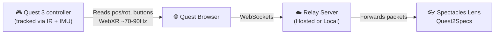

<h1 align="center">🥽 Quest2Specs</h1>

<p align="center">
  Use your <b>Meta Quest controllers</b> as hand input for <b>Snap Spectacles</b>.<br>
  Quest2Specs reads your Quest controller's position, rotation, and button presses, and streams that data to a virtual hand in your Spectacles Lens - so you get full hand tracking, pinch, and grab, regardless of lighting.
</p>

<p align="center">
  <a href="#features">✨ Features</a> •
  <a href="#supported-hardware">🥽 Supported Hardware</a> •
  <a href="#setup">🚀 Setup</a> •
  <a href="#how-it-works">⚙️ How it works</a> •
  <a href="#troubleshooting">🛠️ Troubleshooting</a>
</p>

<p align="center">
  <!-- TODO: replace with a nice hero gif or video link -->
  
</p>

---

<a id="features"></a>
## ✨ Features

| Feature | Description |
| :--- | :--- |
| 👐 **6DoF hand tracking** | The virtual hand follows your real controller's position and rotation 1:1. |
| 🌒 **Works in the dark** | Zero dependency on Spectacles' camera-based hand tracking. |
| 🤏 **Pinch, poke, & grab** | Trigger pinches (index + thumb), grip closes a full fist, and you can poke UI directly. |
| 🎯 **Point-and-select UI** | A ray + cursor lets you select SIK/UIKit interactables at a distance. |
| 🎨 **3D drawing** | Draw in-air, world-locked strokes with the trigger (adjustable thickness/color/auto-delete). |
| 🤲 **Independent hands** | Two hands, independently calibrated and adjustable. |

---

<a id="supported-hardware"></a>
## 🥽 Supported hardware

| Device | Type | Status |
| :--- | :--- | :--- |
| **Quest 3** | Headset | ✅ Supported (tested on OS Version 2.5 released on June 22, 2026) |
| **Quest 3S** | Headset | ✅ Supported (tested on OS Version 2.5 released on June 22, 2026) |
| **Spectacles (2024)** | Glasses | ✅ Supported |
| **Specs (2026)** | Glasses | ⚠️ Need to test |
| **Quest Pro** | Headset | ⚠️ Need to test |
| **Quest 2** | Headset | ⚠️ Need to test |

> **📝 Note:** Both devices must be connected to the internet (a local WiFi network works fine for both). Self-hosting requires [Node.js](https://nodejs.org) and `cloudflared` on a Mac/PC.

---

<a id="setup"></a>
## 🚀 Setup & Installation

There are two ways to run the bridge server that relays data between your Quest and your Spectacles. 

<details open>
<summary><b>🌐 Method 1: Hosted (Easiest)</b></summary>
<br>
A permanent, always-on server. Nothing to run yourself! This URL never changes, so this is the whole setup every time you use it.

1. **On the Quest**, open the **Quest Browser** and go to **`quest2specs.onrender.com`**.
2. Tap **"Enter VR & stream both controllers."**
3. Take the headset off and place it **in front of you, facing you**, so its cameras can see your controllers (about a meter away, tilted slightly down toward your hands).
4. Put on your Spectacles and launch the **Quest2Specs** Lens.
5. Pick up your Quest controllers.
6. **Calibrate each hand:**
   - Grab your controllers and rest them on your thighs, pointing forward. 
   - Look at your controllers, then **click the joystick** (press down on the thumbstick) to reset that hand. (Do this for both).
   - If needed, fine-tune: **move the joystick** to slide the hand forward/back and left/right. Use the **Primary button** (A / X) to lower it or the **Secondary button** (B / Y) to raise it.
   - **Trigger** pinches (used to select UI and to draw).
   - **Grip** (side squeeze button) makes a full fist.
</details>

<details>
<summary><b>💻 Method 2: Self-hosted (For Developers)</b></summary>
<br>
Useful for development or if you'd rather not depend on a hosted server. The free tunnel URL changes every time you start it.

1. **On your Mac**, open a terminal and start the relay:
   ```bash
   cd /path/to/SpecsQuest/QuestBridge/relay
   npm start
   ```
2. In a **second terminal window**, open a tunnel to it:
   ```bash
   cloudflared tunnel --url http://localhost:8080
   ```
3. Copy the `https://xxxx.trycloudflare.com` URL it prints. Save it somewhere you can open on the Quest later.
4. **In Lens Studio**, paste that same URL into **both** `ControllerHandDriver` components' `url` field - but swap `https://` for `wss://` at the start (the Lens needs the WebSocket address). Save and push the project to your Spectacles.
5. **On the Quest**, open the **original `https://`** URL and tap **"Enter VR & stream both controllers."**
6. Take the headset off, put on your Spectacles, launch the Lens, and calibrate your controllers exactly as in Method 1.
</details>

---

<a id="how-it-works"></a>
## ⚙️ How it works



<details>
<summary><b>📖 Read the technical deep-dive</b></summary>
<br>

**1. The Quest tracks the controller.** 
Quest 3 controllers are tracked using infrared light combined with the controller's own motion sensors. This makes the project work in low light - the Quest doesn't need visible light to know where your hand is.

**2. A webpage reads that tracking data.** 
Quest2Specs is a small webpage using WebXR (a browser API for VR/AR data). Every rendered frame, it reads each controller's position, rotation, and button states, and sends that as a small message over the internet.

**3. A relay server passes it along.** 
Spectacles can't talk to the Quest directly, so a small server sits in between and simply forwards every message it receives from the Quest to the Spectacles.

**4. The Lens moves a virtual hand to match.** 
A script running in the Spectacles Lens (`ControllerHandDriver`) receives that stream and drives a 3D hand rig. The trigger curls the index finger and thumb into a pinch, and the grip curls the rest of the fingers into a fist.

**5. The tricky part - lining up two separate "worlds."** 
The Quest and the Spectacles each track space independently. The two worlds get lined up at the moment you **click the joystick**, using a fixed offset: the Lens takes the direction you're currently looking, applies an offset, and places the hand model at the resulting spot. The hand model's forward is set to match whichever direction the controller is pointing. 

> 💡 **Calibration Tip:** The mapping between the controller's tilt and the hand's tilt is captured at the moment you click reset. That's why the calibration step has you rest the controller flat on your thigh, pointing forward!

</details>

---

<a id="troubleshooting"></a>
## 🛠️ Troubleshooting & Structure

<details open>
<summary><b>🔧 Troubleshooting Guide</b></summary>
<br>

| Symptom | Things to try |
| :--- | :--- |
| 🐌 **Laggy or mismatched movement** | 1. Make sure your controllers are in the Quest's field of view, especially in the dark. 2. Could be a WiFi issue. Make sure both the Quest and your Spectacles and/or your Mac/relay are on a strong connection. Testing with your Mobile Hotspot is another suggestion. |
| 👻 **Random pinches / out of sync** | Check that only **one** Quest device is streaming to the relay at a time. Old tabs in a PC or a second headset will mix data. |
| 🟦 **Blank teal screen in VR** | Expected behavior! The WebXR page doesn't render a scene, it only streams data. A status panel is shown at eye level. |
| 🧭 **Drifting position over time** | Devices can drift over a long session. Click the joystick again to re-anchor, then fine-tune with the joystick/buttons. |
| 📐 **Tilted / weird hand angle** | The controller was tilted or in a weird orientation when reset. Grab your controllers, rest your arm flat on your thigh, pointing forward, and click joystick again to reset. |

</details>

<details>
<summary><b>📁 Project Structure</b></summary>
<br>

| Path | Description |
| :--- | :--- |
| 📂 `Assets/Scripts/` | Lens Studio scripts (hand driver, interactors, UI toggles, drawing) |
| 🌐 `QuestBridge/webxr/` | The WebXR page you open in the Quest Browser |
| 🖥️ `QuestBridge/relay/` | The relay server (Node.js) - deploy this or run it locally |

</details>

<p align="center">
  <i>This project is open source - contributions and forks welcome.</i> 🤝
</p>
